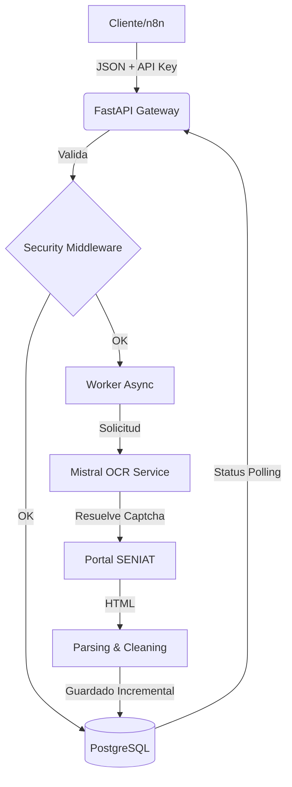

---

#  RIF Validator API

Sistema de procesamiento masivo para la validación y extracción de datos fiscales venezolanos. Utiliza **FastAPI** para la lógica de negocio, **Mistral OCR** para la resolución de captchas y **n8n** como motor de orquestación.

##  Tabla de Contenidos
1. [Guía de Instalación](#-guía-de-instalación)
2. [Arquitectura del Sistema](#-arquitectura-del-sistema)
3. [Hardening y Seguridad](#-hardening-y-seguridad)
4. [Documentación de la API](#-documentación-de-la-api)
5. [Procesamiento Batch y OCR](#-procesamiento-batch-y-ocr)
6. [Workflows n8n](#-workflows-n8n)
7. [Runbook de Backup y Restore](#-runbook-de-backup-y-restore)

---

##  Guía de Instalación

### Requisitos Previos
*   **Docker Desktop** (Asegúrate de que esté iniciado).
*   **Clave de API de Mistral AI** (Para el OCR).

### Instalación Rápida (Windows)
1.  Clona este repositorio.
2.  Crea un archivo `.env` basado en `.env.example`.
3.  Ejecuta el archivo `gestionar_n8n.bat`.
4.  Selecciona la **Opción 1: Iniciar Todo el Sistema**.

### Instalación Manual (Linux/Mac)
```bash
cp .env.example .env
# Edita el .env con tus credenciales
docker-compose up -d --build
```

---

##  Arquitectura del Sistema

El sistema utiliza una arquitectura orientada a servicios (Microservices-lite) orquestada por Docker Compose.

### Diagrama de Flujo


---

##  Hardening y Seguridad
Se ha aplicado un endurecimiento básico del sistema siguiendo estos criterios:

*   **Usuarios/Roles:** Los contenedores corren con usuarios de permisos limitados (`node` en n8n).
*   **Aislamiento:** La base de datos y Redis no exponen puertos al exterior (solo accesibles por la red interna de Docker).
*   **Autenticación:** Middleware `X-API-KEY` operativo en todos los endpoints de FastAPI.
*   **Variables de Entorno:** Gestión estricta de secretos; nunca se suben al control de versiones.

---

##  Documentación de la API

### Configuración
*   **URL Base:** `http://localhost:8000/v1`
*   **Auth:** Header `X-API-KEY` (Configurada en el `.env`).

### Endpoints Principales

| Método | Ruta | Descripción |
| :--- | :--- | :--- |
| `POST` | `/validar` | Validación matemática de RIF (Sin scraping). |
| `POST` | `/extraer` | Inicia lote de extracción SENIAT (Retorna `id_lote`). |
| `GET` | `/consultar/{id_lote}` | Estado del progreso y métricas de éxito/fallo. |
| `GET` | `/consultar/{id_lote}/resultados` | Descarga de la data procesada. |

**Ejemplo de Request (Extraer):**
```json
{
  "items": [
    {"rif": "V-12345678-9", "global_id": "FACT-001"}
  ],
  "retention_hours": 24
}
```

---

##  Procesamiento Batch y OCR

*   **Integración OCR:** Se utiliza `mistral-ocr-latest`. El sistema captura el captcha del SENIAT, lo procesa via Mistral y reintenta automáticamente si la resolución falla.
*   **Manejo de Errores:** Implementa **Exponential Backoff** (2s, 4s, 8s...) mediante la librería `tenacity`.
*   **Concurrencia:** Limitada por `MAX_CONCURRENCY` para evitar bloqueos por IP desde el portal del SENIAT.
*   **Persistencia Incremental:** Si el proceso se detiene, los resultados parciales ya están guardados en la DB.

---

##  Workflows n8n

El sistema incluye dos flujos principales (ubicados en `/n8n_data` o exportables):

1.  **Workflow de Ingesta:** Recibe archivos JSON/Excel, limpia los datos y dispara el `id_lote` en la API.
2.  **Workflow de Polling:**
    *   Consulta cada 1 min el estado del lote.
    *   Maneja reintentos en caso de error de red.
    *   Notifica vía Webhook/Email al finalizar el procesamiento.

---

##  Runbook de Backup y Restore

### Procedimiento de Backup
El sistema realiza backups totales (Datos + Config) mediante el script `gestionar_n8n.bat`.
1.  Abrir `gestionar_n8n.bat`.
2.  Seleccionar **Opción 5: CREAR BACKUP TOTAL**.
3.  El backup se guardará en la carpeta `backups/backup_YYYY-MM-DD_HH-MM`.

### Procedimiento de Restore
1.  Detener los servicios: `docker compose down`.
2.  Copiar el contenido de `postgres_data` y `n8n_data` desde la carpeta de backup a la raíz del proyecto.
3.  Verificar que el archivo `.env` coincida con el del backup.
4.  Iniciar el sistema: `docker compose up -d`.

---

##  
*   **Backup/Restore:** Probado satisfactoriamente mediante el script `.bat`.
*   **Contratos:** OpenAPI/Swagger disponible en `http://localhost:8000/docs`.
*   **Logs:** Logs de reintentos visibles en `docker compose logs -f fastapi-app`.
*   **Trazabilidad:** Cada item procesado está vinculado a un `id_lote` único.

---
